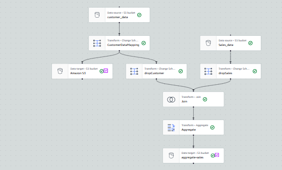
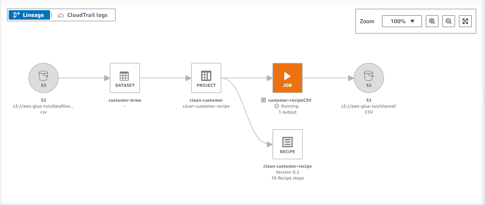

# End-to-End Data Pipeline with AWS Glue, S3, and AWS Glue DataBrew

This project demonstrates the design and implementation of a fully serverless data pipeline using AWS Glue, Amazon S3, and AWS Glue DataBrew. The workflow automates data ingestion, schema discovery, transformation, profiling, and data preparation.

---

## Project Architecture

            +-------------------------+
            |    Source Data Files    |
            +------------+------------+
                         |
                         v
            +-------------------------+
            |        Amazon S3        |
            |   (Raw Data Storage)    |
            +------------+------------+
                         |
                         v
            +-------------------------+
            |   AWS Glue Crawler      |
            | Auto Schema Detection   |
            +------------+------------+
                         |
                         v
            +-------------------------+
            |  AWS Glue Data Catalog  |
            |  (Metadata Repository)  |
            +------------+------------+
                         |
                         v
            +-------------------------+
            |  AWS Glue Studio (ETL)  |
            | Data Cleaning & Transform|
            +------------+------------+
                         |
                         v
            +-------------------------+
            |     Amazon S3 (Curated) |
            +------------+------------+
                         |
                         v
            +-------------------------+
            |   AWS Glue DataBrew     |
            | Profiling | Recipes     |
            +------------+------------+
                         |
                         v
            +-------------------------+
            | Amazon S3 (Final Output)|
            +-------------------------+

---

## Technologies Used

- **Amazon S3** – Storage for raw and processed data  
- **AWS Glue** – Data cataloging and ETL  
- **AWS Glue Studio** – Visual ETL job builder  
- **AWS Glue DataBrew** – Data profiling and preparation  
- **AWS IAM** – Permissions and role management  

---

## Project Workflow

### **1. Load Data into S3**
Uploaded raw datasets into an S3 bucket as the first step of ingestion.

### **2. Catalog Data Using AWS Glue Crawler**
- Created a crawler in **Glue Studio**  
- Automatically detected schema  
- Registered tables in the **AWS Glue Data Catalog**

### **3. ETL Development Using Glue Studio**
- Built a visual ETL workflow  
- Cleaned and transformed data  
- Wrote the processed dataset back to Amazon S3 (curated zone)

### **4. Data Profiling with DataBrew**
- Imported data into DataBrew  
- Created a **Job Profile** for quality assessment  
- Built a **DataBrew Project** for exploration

### **5. Data Preparation with DataBrew Recipe**
- Applied transformation steps such as:
  - Normalization  
  - Cleaning null values  
  - Formatting columns  
- Exported the final dataset to Amazon S3

## Final Output

A complete, automated, and serverless data pipeline that performs:

- Schema detection  
- ETL processing  
- Data quality profiling  
- Data preparation  
- Storage of final clean dataset in Amazon S3  

---

## AWS Services Explained

### **🔹 AWS Glue**
AWS Glue is a fully managed extract-transform-load (ETL) service. It was used:

- Discover datasets automatically  
- Store metadata in a Data Catalog  
- Run ETL jobs without managing servers   
- It is ideal for building scalable data pipelines.

---

### **🔹 AWS Glue Studio**
Glue Studio is the **visual interface** inside AWS Glue.

This was used to:

- Build ETL jobs using a drag-and-drop editor  
- Preview data transformations  
- Auto-generate PySpark/Scala code  
- Run, monitor, and schedule ETL jobs  

It removes the need to manually write Spark scripts.

---

### **🔹 AWS Glue DataBrew**
DataBrew is a **no-code data preparation tool** for cleaning and profiling data.

It helps:

- Profile data (statistics, missing values, distributions)  
- Build **recipes** of transformation steps  
- Diagnose data quality issues  
- Export cleaned data to S3  
---

