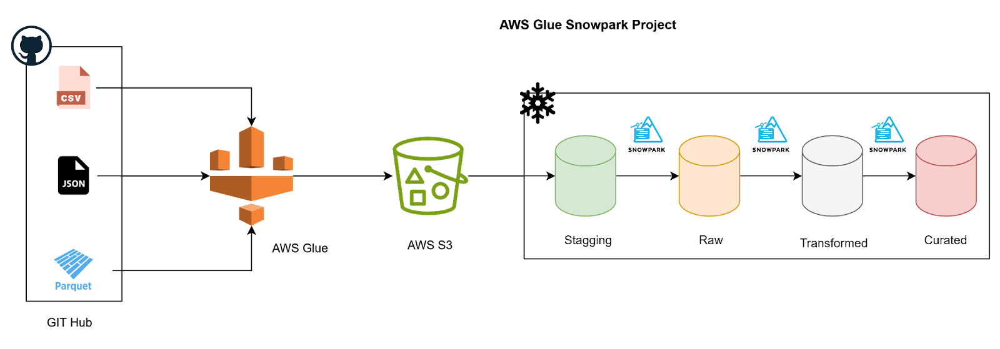

# AWS Glue & Snowpark End-to-End ELT Pipeline

## 📌 Project Overview

This project automates the extraction, loading, transformation, and aggregation of multi-country sales data using AWS Glue, Amazon S3, and Snowflake Snowpark.
The pipeline standardizes different file formats, consolidates them, and prepares curated datasets for analytics and reporting.

## 🎯 Objective

Build a fully automated ELT workflow that:

Extracts sales files from GitHub

Loads structured data into Snowflake

Applies transformations with Snowpark

Produces curated analytics-ready datasets

## 📂 Data Sources

Sales order files are stored in a GitHub repository with different formats per country:

Country	File Format
India	CSV
USA	Parquet
France	JSON

## 🏗️ ELT Workflow
1️⃣ Data Extraction & Storage (AWS Glue + S3)

An AWS Glue Python script connects to the GitHub repository.

It downloads all sales files (CSV, Parquet, JSON).

Files are stored in an Amazon S3 bucket inside country-specific folders.

This forms the landing zone for the pipeline.

2️⃣ Load Data Into Snowflake (Snowpark + STAGING Schema)

Snowpark is used to connect to Snowflake and process multi-format files.

Data is ingested from S3 into STAGING tables using the Snowflake COPY INTO command.

Basic validation occurs in Staging.

Valid records are then moved into the RAW schema.

3️⃣ Transform & Standardize Data (Snowpark + RAW → TRANSFORMED)

Once the three datasets are in RAW, transformation logic is applied:

Column renaming and standardization

Rearrangement of column order

Addition of new computed fields

Splitting complex fields into multiple columns

Unifying all three datasets through a UNION operation

The final standardized dataset is stored inside the TRANSFORMED schema.

4️⃣ Aggregations & Final Curated Layer (Snowpark + CURATED Schema)

Snowpark is used to compute business-level metrics such as:

`Total sales`

`Country-based summaries`

`Product-level analysis`

These final analytical datasets are written into the CURATED schema, optimized for dashboards and reporting tools.

✅ Outcome

This pipeline delivers:

Automated ingestion from GitHub

Consistent file processing across three formats

Clean, unified datasets in Snowflake

Aggregated analytics-ready tables

A scalable ELT architecture across AWS and Snowflake

This enables accurate reporting, faster insights, and easier downstream integration.

📦 Repository Structure
/project
│── glue_scripts/
│     └── extract_github_data.py
│── snowpark_jobs/
│     └── transformations.py
│── sql/
│     ├── staging_tables.sql
│     ├── raw_tables.sql
│     └── curated_views.sql
│── images/
│     └── Architecture.png
│── README.md

### creating the database in snowflake

CREATE
OR REPLACE DATABASE SNOWPARK_DB;
-- creatging various schemas
CREATE SCHEMA STAGGING;
CREATE SCHEMA RAW;
CREATE SCHEMA TRANSFORMED;
CREATE SCHEMA AGGREGATED;
-- setting up stagging schema
USE DATABASE SNOWPARK_DB;
USE SCHEMA SNOWPARK_DB.STAGGING;
-- creating tables
CREATE
OR REPLACE TABLE SNOWPARK_DB.STAGGING.INDIA_SALES_ORDER_CP (
    ORDER_ID VARCHAR(1000),
    CUSTOMER_NAME VARCHAR(1000),
    MOBILE_MODEL VARCHAR(1000),
    QUANTITY VARCHAR(1000),
    PRICE_PER_UNIT VARCHAR(1000),
    TOTAL_PRICE VARCHAR(1000),
    PROMOTION_CODE VARCHAR(1000),
    ORDER_AMOUNT VARCHAR(1000),
    GST VARCHAR(1000),
    ORDER_DATE VARCHAR(1000),
    PAYMENT_STATUS VARCHAR(1000),
    SHIPPING_STATUS VARCHAR(1000),
    PAYMENT_METHOD VARCHAR(1000),
    PAYMENT_PROVIDER VARCHAR(1000),
    MOBILE VARCHAR(1000),
    DELIVERY_ADDRESS VARCHAR(1000)
);
CREATE
OR REPLACE TABLE SNOWPARK_DB.STAGGING.USA_SALES_ORDER_CP (SOURCE_DATA VARIANT);
CREATE
OR REPLACE TABLE SNOWPARK_DB.STAGGING.FRANCE_SALES_ORDER_CP (SOURCE_DATA VARIANT);
CREATE STORAGE INTEGRATION SNOWPARAK_INT TYPE = EXTERNAL_STAGE ENABLED = TRUE STORAGE_PROVIDER = 'S3' STORAGE_AWS_ROLE_ARN = 'arn:aws:iam::412381777262:role/snowflake-snopark-role' STORAGE_ALLOWED_LOCATIONS = ('s3://snowparkglue-bucket/') DESC INTEGRATION SNOWPARAK_INT;
-- stagging
CREATE STAGE SNOWPARK_DB.STAGGING.SNOWPARK_STAGE STORAGE_INTEGRATION = SNOWPARAK_INT URL = 's3://snowparkglue-bucket/' -- verifying stagging
ls @SNOWPARK_DB.STAGGING.SNOWPARK_STAGE;

### coping data from stage

import snowflake.snowpark as snowpark

def main(session: snowpark.Session):

    # seting up schema and database
    
    session.sql('USE SCHEMA SNOWPARK_DB.STAGGING').collect()

     # truncating tables
    
    session.sql('TRUNCATE TABLE SNOWPARK_DB.STAGGING.INDIA_SALES_ORDER_CP').collect()

    session.sql('TRUNCATE TABLE SNOWPARK_DB.STAGGING.USA_SALES_ORDER_CP').collect()

    session.sql('TRUNCATE TABLE SNOWPARK_DB.STAGGING.FRANCE_SALES_ORDER_CP').collect()

    # loading data

    session.sql("""COPY INTO SNOWPARK_DB.STAGGING.INDIA_SALES_ORDER_CP
                FROM @SNOWPARK_DB.STAGGING.SNOWPARK_STAGE/INDIA-Sales-Order.csv
                FILE_FORMAT = (TYPE =CSV SKIP_HEADER = 1 FIELD_OPTIONALLY_ENCLOSED_BY ='"')""").collect()
    
    session.sql("""COPY INTO SNOWPARK_DB.STAGGING.USA_SALES_ORDER_CP
    FROM @SNOWPARK_DB.STAGGING.SNOWPARK_STAGE/USA-Sales-Order.snappy.parquet
    FILE_FORMAT = (TYPE =PARQUET)""").collect()

    session.sql("""COPY INTO SNOWPARK_DB.STAGGING.FRANCE_SALES_ORDER_CP
    FROM @SNOWPARK_DB.STAGGING.SNOWPARK_STAGE/FRANCE-Sales-Order.json
    FILE_FORMAT = (TYPE = JSON)""").collect()

    # loading data from copy table into raw table
    sql_query = 'SELECT * FROM "SNOWPARK_DB"."STAGGING"."INDIA_SALES_ORDER_CP"'

    df_india_sales_read_new = session.sql(sql_query)

    
    # saving above dataframe into raw tables

    df_india_sales_read_new.write.mode("overwrite").save_as_table("SNOWPARK_DB.RAW.INDIA_SALES_ORDER")

    # creating the USA sales ordwer from the parquet file

    df_usa_sales_read = session.sql("""SELECT
                                    SOURCE_DATA:"Customer Name"::VARCHAR(1000) AS CUSTOMER_NAME,
                                    SOURCE_DATA:"Delivery Adress"::VARCHAR(1000) AS DELIVERY_ADDRESS,
                                    SOURCE_DATA:"Mobile Model"::VARCHAR(1000) AS MOBILE_MODEL,
                                    SOURCE_DATA:"Order Amount"::VARCHAR(1000) AS ORDER_AMOUNT,
                                    SOURCE_DATA:"Order date"::VARCHAR(1000) AS ORDER_DATE,
                                    SOURCE_DATA:"Oder ID"::VARCHAR(1000) AS ORDER_ID,
                                    SOURCE_DATA:"Payment Method"::VARCHAR(1000) AS PAYMENT_METHOD,
                                    SOURCE_DATA:"Payment Provider"::VARCHAR(1000) AS PAYMENT_PROVIDER,
                                    SOURCE_DATA:"Payment Status"::VARCHAR(1000) AS PAYMENT_STATUS,
                                    SOURCE_DATA:"Phone"::VARCHAR(1000) AS PHONE,
                                    SOURCE_DATA:"Price Per Unit"::VARCHAR(1000) AS PRICE_PER_UNIT,
                                    SOURCE_DATA:"Promotion Code"::VARCHAR(1000) AS PROMOTION_CODE,
                                    SOURCE_DATA:"Quantity"::VARCHAR(1000) AS QUANTITY,
                                    SOURCE_DATA:"Shipping Status"::VARCHAR(1000) AS SHIPPING_STATUS,
                                    SOURCE_DATA:"Tax"::VARCHAR(1000) AS TAX,
                                    SOURCE_DATA:"Total Price"::VARCHAR(1000) AS TOTAL_PRICE,
                                    CURRENT_TIMESTAMP() AS INSERT_DTS
                                    FROM SNOWPARK_DB.STAGGING.USA_SALES_ORDER_CP""")
    df_usa_sales_read.write.mode("overwrite").save_as_table(("SNOWPARK_DB.RAW.USA_SALES_ORDER"))

    # creating the france order raw datafame

    complex_sql_query = """
                            SELECT * FROM (
                                            SELECT
                                                B.VALUE:"Customer Name"::VARCHAR(1000) AS CUSTOMER_NAME,
                                                B.VALUE:"Delivery Adress"::VARCHAR(1000) AS DELIVERY_ADDRESS,
                                                B.VALUE:"Mobile Model"::VARCHAR(1000) AS MOBILE_MODEL,
                                                B.VALUE:"Order Amount"::VARCHAR(1000) AS ORDER_AMOUNT,
                                                B.VALUE:"Order date"::VARCHAR(1000) AS ORDER_DATE,
                                                B.VALUE:"Oder ID"::VARCHAR(1000) AS ORDER_ID,
                                                B.VALUE:"Payment Method"::VARCHAR(1000) AS PAYMENT_METHOD,
                                                B.VALUE:"Payment Provider"::VARCHAR(1000) AS PAYMENT_PROVIDER,
                                                B.VALUE:"Payment Status"::VARCHAR(1000) AS PAYMENT_STATUS,
                                                B.VALUE:"Phone"::VARCHAR(1000) AS PHONE,
                                                B.VALUE:"Price Per Unit"::VARCHAR(1000) AS PRICE_PER_UNIT,
                                                B.VALUE:"Promotion Code"::VARCHAR(1000) AS PROMOTION_CODE,
                                                B.VALUE:"Quantity"::VARCHAR(1000) AS QUANTITY,
                                                B.VALUE:"Shipping Status"::VARCHAR(1000) AS SHIPPING_STATUS,
                                                B.VALUE:"Tax"::VARCHAR(1000) AS TAX,
                                                B.VALUE:"Total Price"::VARCHAR(1000) AS TOTAL_PRICE,
                                                CURRENT_TIMESTAMP() AS INSERT_DTS
                                            FROM SNOWPARK_DB.STAGGING.FRANCE_SALES_ORDER_CP A,
                                            LATERAL FLATTEN (INPUT=> A.SOURCE_DATA) B
                                        ) AS subquery_alias
                                        """

    df_france_sales_read = session.sql(complex_sql_query)

   
   
    df_france_sales_read.write.mode("overwrite").save_as_table("SNOWPARK_DB.RAW.FRANCE_SALES_ORDER")
    
    # 
    # return ["Sucessfully Executed the snowpark Code to Load Raw tables from Stagging layer"]
    return df_usa_sales_read

### transformation script

import snowflake.snowpark as snowpark
from snowflake.snowpark.functions import col, lit, split, current_timestamp

def main(session: snowpark.Session): 

    df_india_sales_order = session.sql("""SELECT
                                        ORDER_ID,
                                        CUSTOMER_NAME,
                                        MOBILE_MODEL,
                                        QUANTITY,
                                        PRICE_PER_UNIT,
                                        TOTAL_PRICE,
                                        PROMOTION_CODE,
                                        ORDER_AMOUNT,
                                        GST,
                                        ORDER_DATE,
                                        PAYMENT_STATUS,
                                        SHIPPING_STATUS,
                                        PAYMENT_METHOD,
                                        PAYMENT_PROVIDER,
                                        MOBILE,
                                        DELIVERY_ADDRESS
                                        FROM SNOWPARK_DB.RAW.INDIA_SALES_ORDER""")

    # renaming columns
    df_india_sales_order_renamed = df_india_sales_order.rename("GST", "TAX").rename("MOBILE", "CONTACT_NUMBER")

    # adding country field
    df_india_sales_order_country = df_india_sales_order_renamed.withColumn("COUNTRY", lit("INDIA"))

    # USA sales order
    df_usa_sales_order = session.sql("""SELECT
                                        ORDER_ID,
                                        CUSTOMER_NAME,
                                        MOBILE_MODEL,
                                        QUANTITY,
                                        PRICE_PER_UNIT,
                                        TOTAL_PRICE,
                                        PROMOTION_CODE,
                                        ORDER_AMOUNT,
                                        TAX,
                                        ORDER_DATE,
                                        PAYMENT_STATUS,
                                        SHIPPING_STATUS,
                                        PAYMENT_METHOD,
                                        PAYMENT_PROVIDER,
                                        PHONE,
                                        DELIVERY_ADDRESS
                                        FROM SNOWPARK_DB.RAW.USA_SALES_ORDER""")

    # usa sales order rename
    df_usa_sales_order_renamed = df_usa_sales_order.with_column_renamed("PHONE","CONTACT_NUMBER")

    # adding country
    df_usa_sales_order_country = df_usa_sales_order_renamed.with_column("COUNTRY", lit("USA"))

    # france sales order
    df_france_sales_order = session.sql("""SELECT
                                        ORDER_ID,
                                        CUSTOMER_NAME,
                                        MOBILE_MODEL,
                                        QUANTITY,
                                        PRICE_PER_UNIT,
                                        TOTAL_PRICE,
                                        PROMOTION_CODE,
                                        ORDER_AMOUNT,
                                        TAX,
                                        ORDER_DATE,
                                        PAYMENT_STATUS,
                                        SHIPPING_STATUS,
                                        PAYMENT_METHOD,
                                        PAYMENT_PROVIDER,
                                        PHONE,
                                        DELIVERY_ADDRESS
                                        FROM SNOWPARK_DB.RAW.FRANCE_SALES_ORDER""")

    # france sales order renamed
    df_france_sales_order_renamed = df_france_sales_order.with_column_renamed("PHONE", "CONTACT_NUMBER")

    df_france_sales_order_country = df_france_sales_order_renamed.withColumn("COUNTRY", lit("FRANCE"))

    # union india and usa order sales

    df_india_usa_sales_order = df_india_sales_order_country.union(df_usa_sales_order_country)

    df_union_sales_order = df_india_usa_sales_order.union(df_france_sales_order_country)

    # filling missing values

    df_union_sales_order_fill = df_union_sales_order.fillna("NA", subset = "promotion_code")

    # split mobile model

    df_union_sales_order_split = df_union_sales_order_fill\
                                .withColumn("MOBILE_BRAND", split(col("MOBILE_MODEL"), lit("/")).getItem(0).cast("string"))\
                                .withColumn("MOBILE_VERSION", split(col("MOBILE_MODEL"), lit("/")).getItem(1).cast("string"))\
                                .withColumn("MOBILE_COLOR", split(col("MOBILE_MODEL"), lit("/")).getItem(2).cast("string"))\
                                .withColumn("MOBILE_RAM", split(col("MOBILE_MODEL"), lit("/")).getItem(3).cast("string"))\
                                .withColumn("MOBILE_MEMORY", split(col("MOBILE_MODEL"), lit("/")).getItem(4).cast("string"))

    # rearranging column

    df_union_sales_order_final = df_union_sales_order_split.select(col("ORDER_ID"),
                                                                   col("CUSTOMER_NAME"),
                                                                   col("MOBILE_BRAND"),
                                                                   col("MOBILE_VERSION").alias("MOBILE_MODEL"),
                                                                   col("MOBILE_COLOR"),
                                                                   col("MOBILE_RAM"),
                                                                   col("MOBILE_MEMORY"),
                                                                   col("PROMOTION_CODE"),
                                                                   col("PRICE_PER_UNIT"),
                                                                   col("TOTAL_PRICE"),
                                                                   col("ORDER_AMOUNT"),
                                                                   col("TAX"),
                                                                   col("ORDER_DATE"),
                                                                   col("PAYMENT_STATUS"),
                                                                   col("SHIPPING_STATUS"),
                                                                   col("PAYMENT_METHOD"),
                                                                   col("PAYMENT_PROVIDER"),
                                                                   col("CONTACT_NUMBER"),
                                                                   col("COUNTRY"),
                                                                   col("QUANTITY"),
                                                                   col("DELIVERY_ADDRESS")).withColumn("INSERT_DTS",current_timestamp())

    # loading data

    df_union_sales_order_final.write.mode("overwrite").save_as_table("SNOWPARK_DB.TRANSFORMED.GLOBAL_SALES_ORDER")
    
    
    # return "Code loaded sucessfully to transformed table"
    return df_union_sales_order_final

### Aggregation script

import snowflake.snowpark as snowpark
from snowflake.snowpark.functions import col, sum, year, quarter, to_date, concat, lit

def main(session: snowpark.Session): 
    # setting current database
    session.sql('USE  SCHEMA SNOWPARK_DB.TRANSFORMED').collect()

    # global sales order delivered
    df_global_sales_order_delivered = session.table("SNOWPARK_DB.TRANSFORMED.GLOBAL_SALES_ORDER").\
        filter(col("SHIPPING_STATUS") == 'Delivered')

    # load the data into the table
    df_global_sales_order_delivered.write.mode("overwrite").save_as_table("SNOWPARK_DB.AGGREGATED.GLOBAL_SALES_ORDER_DELIVERD")

    # aggregating sales base on mobile brand

    df_global_sales_order_brand = session.table("SNOWPARK_DB.TRANSFORMED.GLOBAL_SALES_ORDER").\
        groupBy(col("MOBILE_BRAND"), col("MOBILE_MODEL")).\
        agg(sum(col("TOTAL_PRICE")).alias("TOTAL_SALES_AMOUNT"))

    df_global_sales_order_brand.write.mode("overwrite").save_as_table("SNOWPARK_DB.AGGREGATED.GLOBAL_SALES_ORDER_BRAND")

    # global sales order by country

    df_global_sales_order_country = session.table("SNOWPARK_DB.TRANSFORMED.GLOBAL_SALES_ORDER").\
        groupBy(col("COUNTRY"),
                year(to_date(col("ORDER_DATE"))).alias("YEAR"),
                concat(lit("Q"), quarter(to_date(col("ORDER_DATE")))).alias("QUARTER")).\
                    agg(sum(col("QUANTITY")).alias("TOTAL_SALES_VOLUME"), sum(col("TOTAL_PRICE")).alias("TOTAL_SALES_AMOUNT"))

    # load data to table

    df_global_sales_order_country.write.mode("overwrite").save_as_table("SNOWPARK_DB.AGGREGATED.GLOBAL_SALES_ORDER_COUNTRY")

    
    
    
    return df_global_sales_order_brand`
