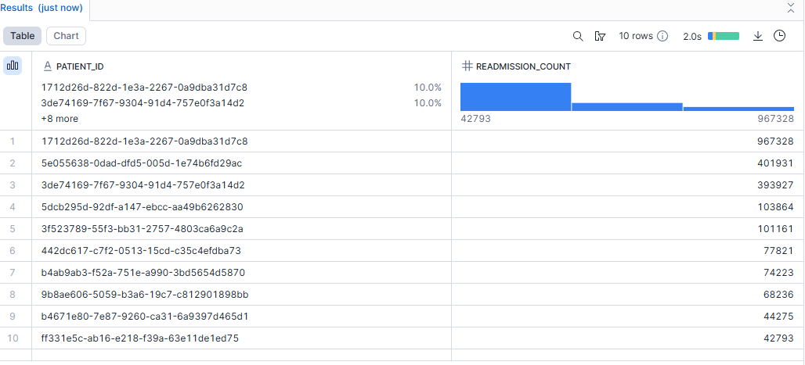

# Hospital Data Engineering Pipeline (AWS S3 + Snowflake + Python)

This project demonstrates a complete end-to-end **data engineering pipeline** built using Python, AWS S3, and Snowflake. The dataset consists of hospital records split across multiple related CSV files. The goal is to build a scalable pipeline that handles data cleaning, cloud storage, automated schema generation, and warehouse loading.

---

## Project Overview

This project simulates the workflow of a real-world data engineering system. It includes:

* **Data cleaning** with Pandas
* **Relational data modeling** (patients, encounters, payers, procedures)
* **Cloud storage** using AWS S3
* **Automated schema generation** from CSV files
* **Table creation** in Snowflake
* **Data loading** using Snowflake COPY commands

The system is modular, scalable, and production-ready.

---

## Project Structure

```
project_root/
│
├── data/
│   ├── raw/                 # Original CSVs (not uploaded)
│   └── processed/           # Cleaned datasets ready for S3
│
├── scripts/
│   ├── upload_to_s3.py      # Upload cleaned data to AWS S3
│   ├── generate_snowflake_tables.py   # Auto-generate SQL + create tables
│
├── venv/                    # Virtual environment
│
└── README.md                # Project documentation
```

---

## 1. Data Cleaning (Pandas)

Each CSV was cleaned and standardized:

* Lowercased + normalized column names
* Converted datatypes (numbers, dates)
* Removed duplicates
* Filled or handled missing values
* Exported to `/processed/*.csv`

The four key datasets:

* `patients_clean.csv`
* `encounters_clean.csv`
* `payers_clean.csv`
* `procedures_clean.csv`

These share relational keys (`patient_id`, `encounter_id`).

---

## 2. Upload to AWS S3

A dedicated S3 bucket was created:

All cleaned CSVs were uploaded using the Python script:

* `boto3` used for secure file upload
* AWS CLI used for access key configuration

The upload script automatically pushes all processed files into the S3 folder.

---

## 3. Snowflake Setup

A Snowflake database and schema were created:

```sql
CREATE DATABASE IF NOT EXISTS HOSPITAL_DB;
CREATE SCHEMA IF NOT EXISTS MY_SCHEMA;
```

A compute warehouse was selected:

```sql
USE WAREHOUSE COMPUTE_WH;
```

Context set:

```sql
USE DATABASE HOSPITAL_DB;
USE SCHEMA MY_SCHEMA;
```

---

## 4. Automated Table Schema Generation

A Python script was created to:

* Read CSV headers
* Infer Snowflake column datatypes
* Auto-generate CREATE TABLE statements
* Save them into a `.sql` file

This eliminates manual schema creation.

---

## 5. Table Creation in Snowflake

Tables created:

* `cleaned_patients`
* `cleaned_encounters`
* `cleaned_payers`
* `cleaned_procedures`

---

## 6. Data Loading into Snowflake
A Storage Integration was created to connect AWS S3 to Snowflake using the **CREATE STORAGE INTEGRATION**
and then **STAGE** the `.csv` files into the Snowflake Schema

Data was loaded directly from AWS S3 using:

```sql
COPY INTO my_schema.patients_clean
FROM @hospital_stage/patients_clean.csv
FILE_FORMAT = (TYPE = CSV FIELD_DELIMITER = ',' SKIP_HEADER = 1);
```
The same procedure was repeated for the remaining tables.

All tables loaded successfully.

---

## 📘 Skills Demonstrated

* Data Engineering (ETL/ELT)
* Cloud Storage (AWS S3)
* Columnar/Relational Modeling
* Python automation (boto3 + Snowflake Connector)
* Warehouse design (Snowflake)
* SQL (DDL + DML)

---

## Analytical Queries (SQL)

The following SQL queries were used to analyze the hospital data:
## OBJECTIVE 1: ENCOUNTERS OVERVIEW

1. **Total Encounters Per Year**
```sql
SELECT "YEAR", COUNT(*) AS total_yearly_encounter
FROM
    cleaned_encounters
GROUP BY
    YEAR
ORDER BY
    YEAR ASC
LIMIT
    100;
```


2. **Encounter Class Distribution**
```sql
SELECT encounter_class, 
       ROUND(COUNT(*) * 100.0 / (SELECT COUNT(*) FROM my_schema.cleaned_encounters),2) AS percentage
FROM my_schema.cleaned_encounters
GROUP BY encounter_class;
```


3. **Encounters Over/Under 24 Hours**
```sql
SELECT 
    CASE 
        WHEN DATEDIFF('hour', admit_time, discharge_time) > 24 THEN 'Over 24 Hours'
        ELSE 'Under 24 Hours'
    END AS duration_category,
    COUNT(*) AS total_encounters
FROM my_schema.cleaned_encounters
GROUP BY duration_category;
```


---
## OBJECTIVE 2: COST & COVERAGE INSIGHTS
1. **Encounters with Zero Payer Coverage**
```sql
SELECT COUNT(*) AS zero_coverage_encounters,
       COUNT(*) * 100.0 / (SELECT COUNT(*) FROM my_schema.cleaned_encounters) AS percentage
FROM my_schema.cleaned_encounters
WHERE payer_coverage = 0;
```

2. **Top 10 Most Frequent Procedures**
```sql
SELECT description, 
       COUNT(*) AS frequency, 
       AVG(base_cost) AS average_base_cost
FROM my_schema.cleaned_procedures
GROUP BY procedure_code
ORDER BY frequency DESC
LIMIT 10;
```
3. **Top 10 Procedures by Average Base Cost**
```sql
SELECT description, 
       AVG(base_cost) AS average_base_cost, 
       COUNT(*) AS times_performed
FROM my_schema.cleaned_procedures
GROUP BY procedure_code
ORDER BY average_base_cost DESC
LIMIT 10;
```


4. **Average Total Claim Cost by Payer**
```sql
SELECT payer_id, 
       AVG(total_claim_cost) AS average_total_claim_cost
FROM my_schema.cleaned_encounters
GROUP BY payer_id;
```
## OBJECTIVE 3: PATIENT BEHAVIOR ANALYSIS
1. **Unique Patients Admitted Each Quarter**
```sql
SELECT DATE_TRUNC('quarter', admission_date) AS quarter, 
       COUNT(DISTINCT patient_id) AS unique_patients
FROM my_schema.cleaned_encounters
GROUP BY quarter
ORDER BY quarter;
```
2. **Patients Readmitted Within 30 Days**
```sql
SELECT COUNT(DISTINCT e1.patient_id) AS readmitted_patients
FROM my_schema.cleaned_encounters e1
JOIN my_schema.cleaned_encounters e2
ON e1.patient_id = e2.patient_id
AND DATEDIFF('day', e1.discharge_date, e2.admission_date) <= 30
WHERE e1.encounter_id <> e2.encounter_id;
```
3. **Patients with Most Readmissions**
```sql
SELECT e1.patient_id, 
       COUNT(*) AS readmission_count
FROM my_schema.cleaned_encounters e1
JOIN my_schema.cleaned_encounters e2
ON e1.patient_id = e2.patient_id
AND DATEDIFF('day', e1.discharge_date, e2.admission_date) <= 30
WHERE e1.encounter_id <> e2.encounter_id
GROUP BY e1.patient_id
ORDER BY readmission_count DESC
LIMIT 10;
```



# Hospital Analytics Questions
-- OBJECTIVE 1: ENCOUNTERS OVERVIEW
-- a. How many total encounters occurred each year?
-- b. For each year, what percentage of all encounters belonged to each encounter class (ambulatory, outpatient, wellness, urgent care, emergency, and inpatient)?
-- c. What percentage of encounters were over 24 hours versus under 24 hours?
-- OBJECTIVE 2: COST & COVERAGE INSIGHTS
-- a. How many encounters had zero payer coverage, and what percentage of total encounters does this represent?

-- b. What are the top 10 most frequent procedures performed and the average base cost for each?

-- c. What are the top 10 procedures with the highest average base cost and the number of times they were performed?

-- d. What is the average total claim cost for encounters, broken down by payer?

-- OBJECTIVE 3: PATIENT BEHAVIOR ANALYSIS

-- a. How many unique patients were admitted each quarter over time?

-- b. How many patients were readmitted within 30 days of a previous encounter?

-- c. Which patients had the most readmissions?

## Status

✔️ Data cleaned
✔️ Uploaded to AWS S3
✔️ Tables created in Snowflake
✔️ Data loaded successfully


## Author

**Michael**
Data Engineer
