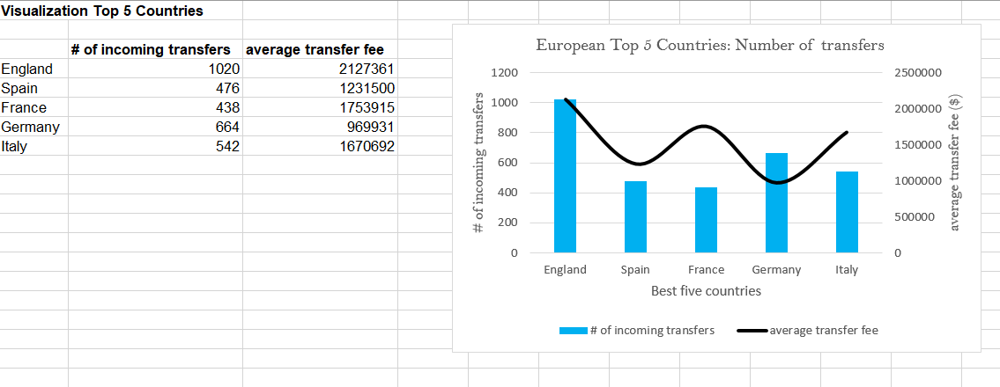

# Project Overview
this project involves complexities and economic patterns within international football. It delves into the movement of players from one association to another, offering an in-depth overview of the economics of international football.

_Possible KPI's_

- The five European countries that invested the most in incoming transfers during the 2022/2023 season.

- The average fee each of these countries paid per player

**Data Cleaning**

Several techniques were imployed, thus data preprocessing and manipulation, filtering and data visualization.

+ the TRIM() function was used to remove white spaces
+ The Text-to-Columns feature was used to separate countries from their continents in the countries worksheet and VLOOKUP to populate the continents with their respective countries in the database worksheet.

+ The season columns was checked for incosistencies of years that seems out of place since the transfers were focused on 2022/2023. This was done by the `filter` option in excel and the `find and replace` feature were used for the correction.

+ The SUMIFS function were used to find the total number of football transfer `in` and `out` of Europe during the two seasons. 
`This was to find the net transfer balance`
+ The SUMIFS function were used to find the net transfer movement for each European country of football transfer `in` and `out` of Europe including the number of transfers and total cost. 
`This will give a clearer picture of how money moves around in European football transfers.`

+ The top five European countries that invested the most in incoming transfers during the 2022/2023 season were identified and a visualization was created for it.
`This was done by the help of the RANK() function`

**Possible Outcomes**

This project offers a blend of passion for football with the excitement of data-driven insights, fostering a deeper understanding of the global football econonomy

# *Focusing on `Europe`,* 
- *The net transfers indicates there were more incoming transfers in the 2021/2022 season as well as that of 2022/2023 season.*

- *The following countries really made a profit of outgoing transfers*
1. Albania
2. Faroe Island
3. Republic of Ireland
4. Latvia
5. FYR Macedonia
6. Northern Ireland
7. Slovenia

- `Kosovo, San Marino and Malta` did have any incoming or outgoing transfers in the 2022/2023 season

- *The top five countries that spent much on incoming transfers in Europe is as follows in order of spending*
1. England
2. Spain
3. Frgance
4. Germany
5. Italy

