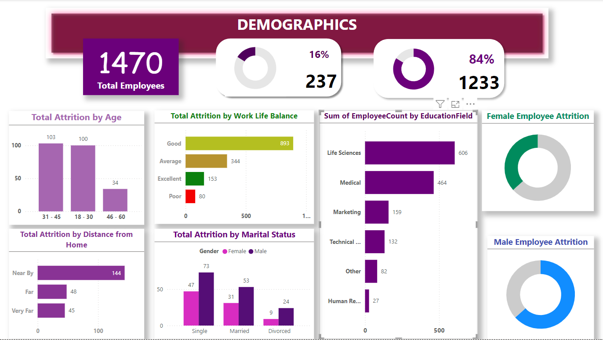
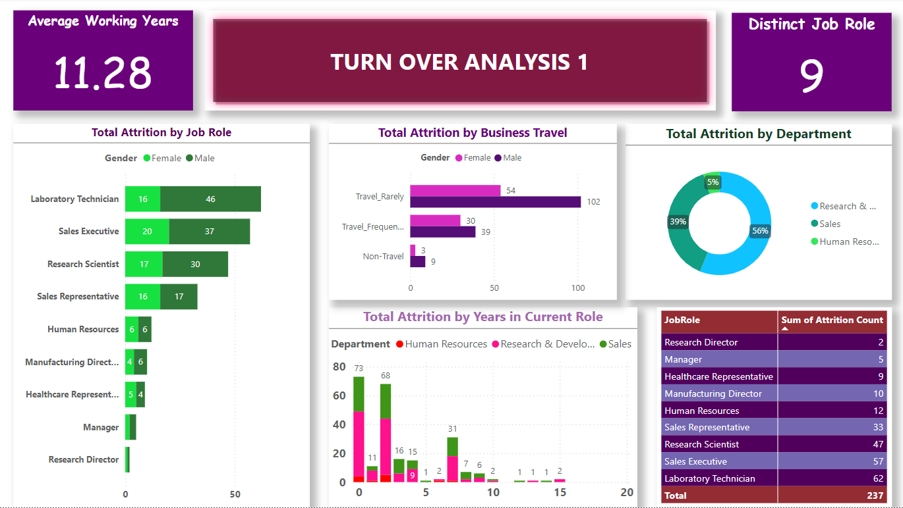
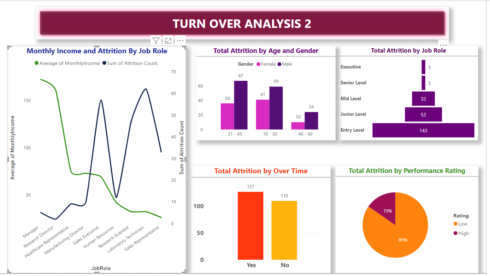
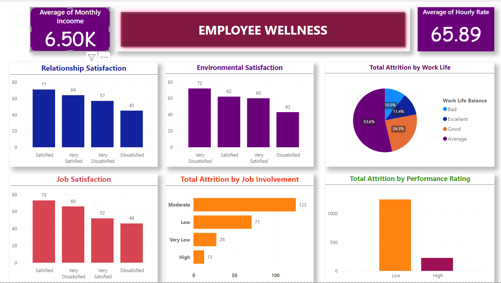

# Project Overview
Delving into the world of human resources, with a keen eye on data analysis to optimize talent management and organizational performance. This focus on **employee attrition** providing insights on workforce diversity, commuting patterns, job roles affected, business travel impact and total years in current role aiding in workforce management and retention strategies.

This visualization consist of four dashboards
The first page includes the demographic insights, the second page focuses on turnover analysis 1, the third page on turnover analysis 2, and the fourth page is dedicated to employee wellness.

# Data Cleaning
- The dataset was imported into Excel and redundant columns were deleted
- Columns renamed for proper description
- Checking duplicates
- Cleaning individual columns for missing values
- Removing the *NAN* values from the dataset

# Data Visualization
Using *Power BI* Visualization was created for the following
- Marital status
- Job role
- Department
- Educational Field
- Gender
- Business travel
- Educational level
-  Total working year
- Distance from home
- Number of companies worked
- Relation between overtime and age