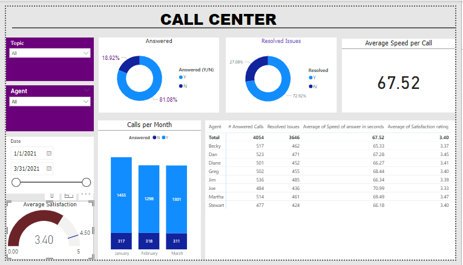

# Call Centre Dashboard

**Project Overview**
To determine accurate overview of long term trends in customer and agent behavior

*Possible KPI's*
- Overall customer satisfaction
- Overall calls answered or abandoned
- Calls by time
-Average speed of answered calls
- Agent performance quadrant(Average handle time(talk diration)vs Calls answered).

**Data Cleaning Process**
- Data was imported into excel for general  overview
- Tackled missing values and outliers using advance techniques
- Checking duplicates, ensuring that the data was clean and reliable for analysis
- Transform data and normalize data to their appropraites datatype.

**Data Visualization**

- I developed an insightful and interactive dashboard visualizing key insights from the dataset

- I developed agent distribution to calls answered and resolved issues as well as average time in seconds of calls answered by agents ans customers satisfaction rates

- Numbered of answered and abandoned calls per months.

- Topics agents they addressed

- Average satisfaction rates
- Average speed per call

*Advanced Measures*

I use DAX to compute measures like number of resolved issues, number of answered calls, Average speed of answered calls.

**Project Outcomes**

`This dashboard gives a clear explanation on resolved issues of customers by call agents of the Telecom Company and can be used as a predictive tool for determine the long term behavior trends of agents and customers which will prevent the abandonment of calls for a high customers satisfaction.`

