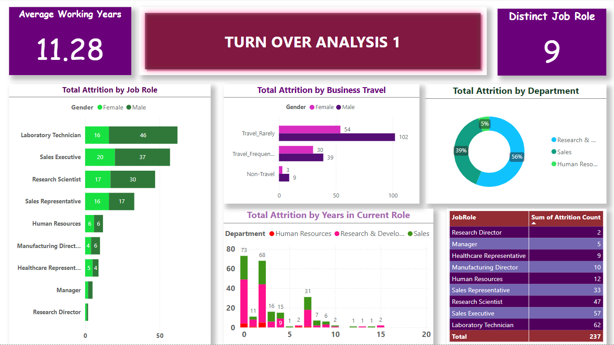

# Project Overview
Delving into the world of human resources, with a keen eye on data analysis to optimize talent management and organizational performance. This focus on **employee attrition** providing insights on workforce diversity, commuting patterns, job roles affected, business travel impact and total years in current role aiding in workforce management and retention strategies.

This visualization consist of four dashboards
The first page includes the demographic insights, the second page focuses on turnover analysis 1, the third page on turnover analysis 2, and the fourth page is dedicated to employee wellness.

## Data Cleaning
- The dataset was imported into Excel and redundant columns were deleted
- Converting data formats
- Removing duplicates and outliers
- Cleaning individual columns for missing values
- Removing the *NAN* values from the dataset
- Check data distribution
- Validate data quality
- Document data dictionary
- Performed data transformation

## Data Visualization
Using *Power BI* Visualization was created for the following
- Marital status
- Job role
- Department
- Educational Field
- Gender
- Business travel
- Educational level
-  Total working year
- Distance from home
- Number of companies worked
- Relation between overtime and age

Function for checking Attrition Count to determine employees that left the company

Attrition Count
SWITCH(true(), 'HR-Employee-Attrition'[Attrition] = "Yes", 1, 'HR-Employee-Attrition'[Attrition] = "No", 0,0)

*finding Active Employee*
Active Employee = SUM('HR-Employee-Attrition'[EmployeeCount])-SUM('HR-Employee-Attrition'[Attrition Count])

*Applying Grouping and Binning*
Grouping helps give clearer view, analyze and explore data amd trends in visuals. This measure was used to group the
`total attrition by work life, attrition by Age, attrition by distance from home`
example *distance from home 1-10 considered as near, 11-20 as far and 21-30 as very far*

## Turnover analysis
turnover analysis is a process that examines the factors that causes employees to leave or stay with a company.
from this `report`
>16% of the total employees left their job, out of this\
>**103** fall into the **31-45** Age group \
>**100** in the **18-30** Age group and \
>**34** in the **46-60** Age group

>**120** were **single** \
>**84** were **married** \
>**33** were **divorced** 

>**144** stays **near** to the workplace \
>**48** lives **far** to the workplace \
>**45** lives **very far** to the workplace

from the second turn over analysis, its likely that employees that left was because of overtime and low monthly income and most of them fall into the Age **18-45**