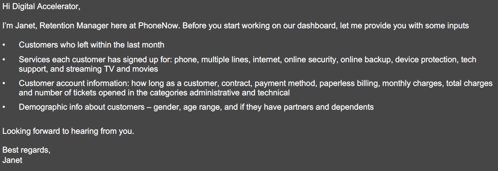
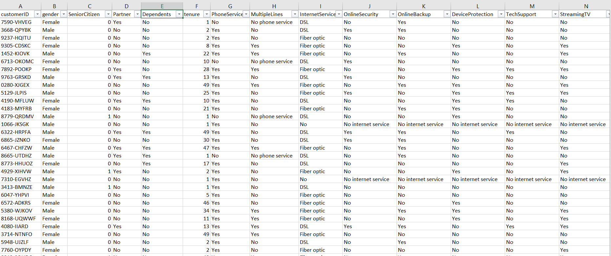
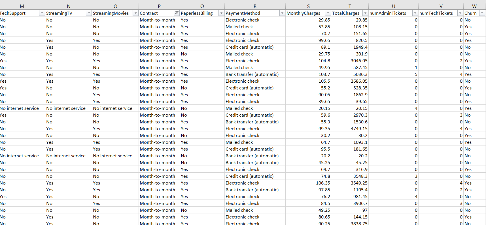

# Objective
To analyze why customers end their relationship with the telecom industry `(PhoneNow)` 
and measures to get them back.

To determine the number of customers who cancelled their supscriptions.

## Possible KPI's
- Total customers at risk
- Number of tech tickets
- Number of admin tickets
- Percentage of senior citizen, dependent 
- Percentage of those with partners
- Percentage of service customers signed up for
- Type of contract

## Data Cleaning Process
- Converting data formats
- Handling missing values
- Check data distribution
- Validate data quality
- normalising data
- Document data dictionary
- Performed data transformation

## Exploring Data

Data Analysis Expression (DAX) was used to create different *measures* to ascertain the various percentages of services customers signed up for and churn rate

## Results
Churn is the measurement of the percentage eof accounts that cancel or choose not to renew their subscriptions. A high churn rate can negatively impact Monthly Recurring Revenue and can also indicates dissactifaction with a product or service.

1. Out of **7043** customenrs **1869** cancel their telecom subscription or decide not to renew.
2. Lost of **885** *Admininstrative ticket* out of **3632**
and **2173** *technical ticket* lost out of **2955**.
3. The *churn rate was **26.54%***.

`A telecom company with an annual churn rate of 26.54% is losing almost a 1/4 of its customers every year. Churn rate of **26.54%** is considered relatively high, indicating potential issues with customers satisfaction, pricing, intense competition or service quality`.

This should be a major concern for `PhoneNow` because acquiring new customers is often more expensive than retaining existing ones. Reducing custumer churn by just **5%** can increase `PhoneNow` profits by up to **25%**.

#### To extenuate this I recommend `PhonNow`:

1. Increase tech support capacity of Fibre Optic customers and lower tech tickets per customer to 0.5.

2. Increase sale of 1 and 2 year contracts by 5% each.

3. Yealy increase of automatic payments by 5%.
4. Implenement incentives to reward loyal customers and encourage retention.
5. Review pricing strategies to stay competitive in the market.