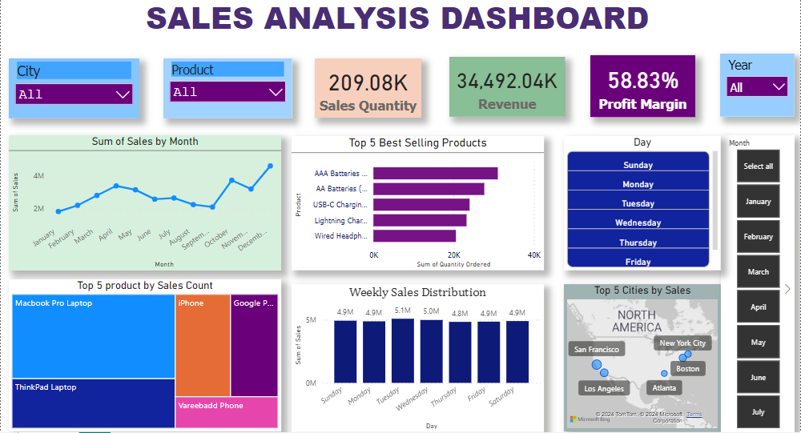

# Project Overview

Analyzing sales data to identify trends, top selling products, sales and profit margins for business decision making.

## Column Description for sales data analysis
- Order ID
- Product
- Quantity Ordered
- Price Each
- Order Date
- Purchase Address
- Month
- Sales
- City
- Hour

## Data Cleaning Process
- Checking missing values and outliers using advance techniques
- removing duplicates, ensuring that the data was clean and reliable for analysis
- Transform data and normalize data to their appropraites datatype.

